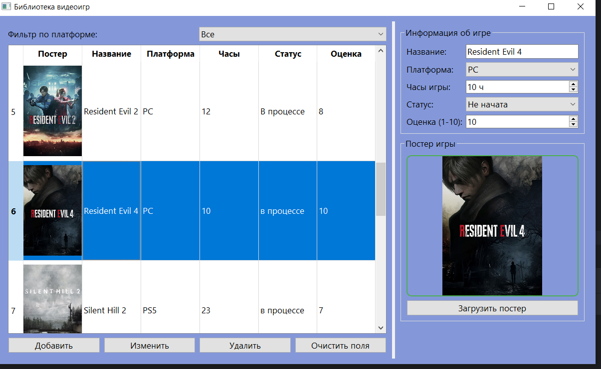
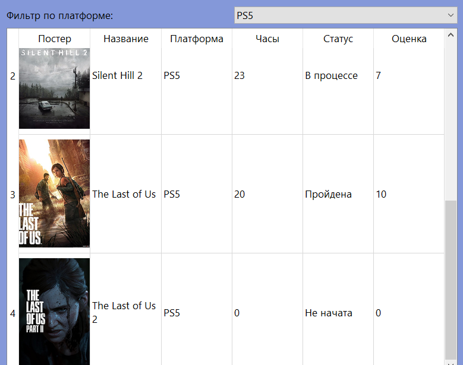

# Библиотека видеоигр

Приложение для ведения личного каталога видеоигр с возможностью добавления, редактирования, удаления и фильтрации записей. Поддерживает загрузку постеров игр и их отображение в таблице.

---

## Скриншоты

  
*Рисунок 1 — Главное окно приложения*

  
*Рисунок 2 — Фильтрация по платформе*

---

## Запуск проекта

1. Создайте виртуальное окружение:  
   `python -m venv venv`

2. Активируйте:  
   - Windows: `venv\Scripts\activate`  
   - macOS/Linux: `source venv/bin/activate`

3. Установите зависимости:  
   `pip install -r requirements.txt`

4. Запустите:  
   `python main.py`

---

## Структура проекта

- `main.py` → Точка входа, настройка QApplication  
- `ui_main.py` → Интерфейс, сигналы, обработка событий  
- `database.py` → Работа с SQLite (CRUD)  
- `requirements.txt` → Зависимости проекта  
- `.gitignore` → Исключения для Git  
- `README.md` → Описание проекта  
- `assets/posters/` → Постеры игр  
- `data/` → База данных (создаётся автоматически)

---

## Возможности

- Добавление игры с заполнением всех полей  
- Редактирование выбранной игры  
- Удаление игры с подтверждением  
- Загрузка постеров через диалог выбора файла  
- Автоматическое масштабирование постеров до 200×280  
- Фильтрация игр по платформе (PC, PS5, Xbox, Mobile)  
- Все данные сохраняются в SQLite (games.db)

---

## Автор

**ФИО:** Крылова Елизавета Сергеевна  
**Группа:** ФМ-14-25

---

**© 2026 — Учебная практика (вычислительная практика)**
